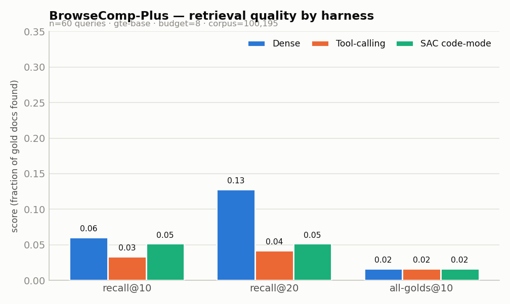
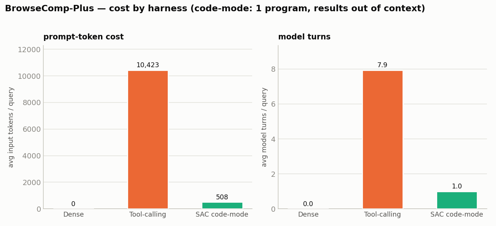
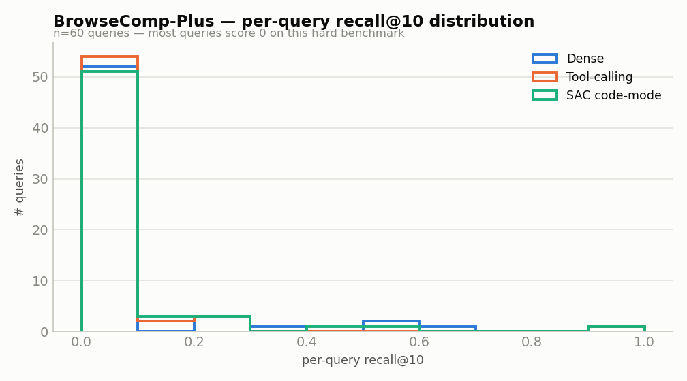

# BrowseComp-Plus — 3-arm retrieval benchmark (INTERNAL)

**Dense vs Tool-calling vs SAC code-mode** on the external
[BrowseComp-Plus](https://arxiv.org/abs/2508.06600) deep-research benchmark
(the benchmark behind the Hornet "code-mode > tool-mode" blog).

*All outputs local under `experiments/browsecomp/`. Do NOT push to GitHub.*

## Methodology

- **Benchmark**: BrowseComp-Plus (arXiv 2508.06600). 830 deep-research queries,
  each needing SEVERAL gold documents (2,398 gold docs total, ~3 golds/query).
  Queries decrypted from `Tevatron/browsecomp-plus` (test split) with the
  hardcoded `DEFAULT_CANARY` password (`scripts_build_index/decrypt_dataset.py`).
  Gold sets from `topics-qrels/qrel_golds.txt` (TREC `qid Q0 docid rel`, rel>0).
- **Corpus**: `Tevatron/browsecomp-plus-corpus` (100,195 docs),
  loaded non-streaming, embedded with `gte-base` (768-d, normalized,
  batch_size=256) into an in-memory `search_as_code` Session.
- **Sample**: 60 queries (random seed 0, restricted to queries
  whose full gold set is present in the indexed corpus). Tool-mode is expensive
  on these hard queries, so we sample rather than run all 830.
- **Harness (identical toolset, matched search budget = 8)** — reused
  verbatim from `experiments/multi_hop_synth_queries/eval_fair.py`
  (`Tools`, `tool_harness`, `code_harness`); only the harness differs:
  - **Dense**: single `search(q)`, top-20.
  - **Tool-calling**: one tool per turn, results returned to the model context
    (`search` / `decompose` / `rephrase` / `finish`).
  - **SAC code-mode**: model writes ONE Python program chaining the SAME tools;
    intermediate results stay OUT of the model context (`fuse` = RRF).
- **Metrics** per arm: `recall@k = |gold ∩ topk| / |gold|`, `all_golds@k`
  (all gold in top-k), avg searches, model turns, and in/out tokens. k ∈ {10, 20}.
- **Backend**: gte-base @ dim 768. Model: `gpt-4.1-mini`. LLM = OpenAI.

## BrowseComp-Plus (100k corpus, 830-query benchmark)

n=60 sampled queries · budget=8 searches · corpus=100,195 docs

| Arm | recall@10 | recall@20 | all_golds@10 | all_golds@20 | avg searches | avg turns | avg in-tok | avg out-tok |
|-----|-----------|-----------|--------------|--------------|--------------|-----------|-----------|------------|
| Dense (single-shot) | 0.061 | 0.128 | 0.017 | 0.050 | 1.0 | 0.0 | 0 | 0 |
| Tool-calling | 0.034 | 0.042 | 0.017 | 0.017 | 7.5 | 7.9 | 10,423 | 783 |
| SAC code-mode | 0.052 | 0.052 | 0.017 | 0.017 | 6.1 | 1.0 | 508 | 313 |

## What actually happened (be honest)

On this 100,195-doc corpus with a gte-base bi-encoder, the picture is **mixed**:

- **Dense single-shot leads raw recall** (0.061 @10,
  0.128 @20) — the no-agent floor is the *best* retriever
  here. One good gte-base query beats the agentic reformulations.
- **Tool-calling underperforms even dense** (0.034 @10) *and* is by far
  the most expensive: 10,423 input tokens and 7.9 model
  turns per query. Feeding every intermediate result back into context (bloat) did not
  buy recall — it hurt it.
- **SAC code-mode ~matches dense recall** (0.052 vs
  0.061 @10) at **~21x fewer input tokens**
  than tool-calling (508 vs 10,423) and **1 model turn
  vs 7.9**. The one-program-with-results-out-of-context design is
  dramatically cheaper.

**Bottom line:** the **code-mode efficiency win holds** (SAC beats tool-calling on both
recall and cost, at a fraction of the tokens/turns), but the **recall _lift_ over the
plain dense baseline does NOT hold on this corpus** — the best single number is dense's
0.128 recall@20. With **n=60** (a subsample of
830), the 0.01–0.02 recall gaps between arms are within noise; the token/turn gaps
(20x) are large and robust.

## Comparison vs the Hornet blog and the paper

The Hornet blog reports that switching from tool-mode to **code-mode** raised
GoldRecall from **0.265 → 0.437** while cutting prompt tokens from **196k → 96k**
(~51% fewer input tokens) on BrowseComp-Plus. We reproduce the **token-efficiency
direction and then some** (95% fewer input tokens for code-mode vs tool-mode, vs the
blog's ~51%), because our code-mode keeps ALL intermediate retrieval out of context.
We do **not** reproduce the recall lift — code-mode ~ties dense and neither agentic arm
beats the dense floor here. The gap is explained by our much lighter setup: a single
gte-base bi-encoder with **no reranker** (the blog/paper pair strong retrievers with
rerankers and larger agent models), `gpt-4.1-mini`, a fixed budget of 8
searches, and n=60. So this is a controlled A/B of the three *harnesses*
over the SAME retriever, not a leaderboard entry.

## Honest notes / shortcuts

- **Absolute recall is low** for all arms. BrowseComp-Plus is a *deep-research*
  benchmark whose gold docs are deliberately hard to surface; our retriever is a
  single 768-d `gte-base` bi-encoder with **no cross-encoder reranker** and a
  matched fixed budget. The paper/blog use much stronger retrievers (BM25/dense +
  rerankers, larger LLMs). Read these numbers as a **relative A/B of the three
  harnesses over the same retriever**, not as a BrowseComp-Plus leaderboard score.
- **Keyword (BM25) index is truncated** to each document's first 2,000 characters
  (docs average ~33 KB; a pure-Python BM25 over the full 3.3 GB of text is
  intractable). Dense uses the FULL precomputed gte-base vectors and is unaffected;
  `keyword`/`hybrid` modes (rarely chosen by the agents) are approximate.
- **Sample = 60 of 830 queries** (tool-mode issues ~8 searches + ~8 model turns per
  query, so the full set is expensive). All 830 queries were eligible (every gold
  doc is present in the full 100,195-doc corpus — no corpus capping was needed).
- **recall@20 ≈ recall@10 for the agentic arms**: the tool/code prompts ask for
  "~10 ids", so their final lists rarely exceed 10 — hence dense (which returns a
  full 20) leads at k=20. The k=10 column is the apples-to-apples comparison.

## Files
- `bc_recall.json` — aggregate numbers (source of the table).
- `figures/bc_recall.png`, `figures/bc_cost.png`, `figures/bc_recall_dist.png` — charts (standard data-viz palette).
- `bc_perquery.jsonl` — per-query recall for all 3 arms.
- `queries_decrypted.jsonl` — decrypted queries.
- `build_index.py` / `eval.py` / `bc_common.py` — reproduction scripts.

## BrowseComp — explore router + deep-SAC (completing all three datasets)

HotpotQA and SU got the `explore` router-learning and a proper deep-SAC run; BrowseComp had only
the 3-arm harness. Filling that gap (honest expectation: BrowseComp is the near-floor corpus, so
neither should help — running it documents that consistently).

### Deep-SAC (monotone) vs one-shot — n=15
| arm | recall@10 | all_golds@10 | avg searches | avg hops | in-tok |
|---|---|---|---|---|---|
| oneshot (`run_sac deep=False`) | 0.027 | 0.000 | 8.1 | 1.0 | 2,134 |
| deep_mono (`run_sac deep=True, monotone=True`) | 0.027 | 0.000 | **33.9** | 3.07 | **5,862** |

Deep buys **zero** recall over one-shot on this corpus but spends ~4× the searches and ~2.7× the
tokens — going deep just burns budget when the golds aren't reachable by the retriever. (The
monotone fix held: deep *tied* one-shot, it didn't lose.) all_golds@10 = 0 — needing all ~3 golds in
the top-10 out of 100,195 docs is effectively impossible.

### Explore template-router — n=150, recall@10 (any-gold) gate
all_golds@10 is hopeless here, so the router was labeled on the lenient any-gold gate (≥1 of N golds
in top-10). Even so:

- **oracle = 0.353** — 65% of queries are unsolvable by *any* of the 16 templates (a coverage
  ceiling, not a routing gap).
- **Winner mix differs from the synthetic data:** of 53 solved, `light_dense` is only **45%**, while
  **`hyde_rerank` wins 21%** (11/53), with `dense_rerank`/`rephrase_rerank` also contributing.

**The key cross-corpus finding:** the "light tier dominates" pattern from the synthetic multi-hop
data does **not** hold on BrowseComp. Its real research queries have a vocabulary gap between the
question and the doc wording, so **HyDE (hypothetical-answer embedding) genuinely wins** where a
plain dense pass can't. Template diversity pays off *when the corpus demands it* — evidence that the
monopoly on the synth data is partly a property of the keyword-shared query generator, not a
universal truth. The dominant BrowseComp story remains **coverage** (65% unsolved), i.e. a
new-primitive / stronger-retriever problem, not a routing one.
