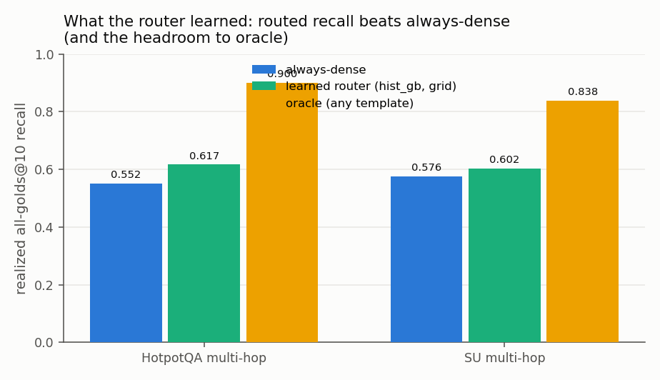
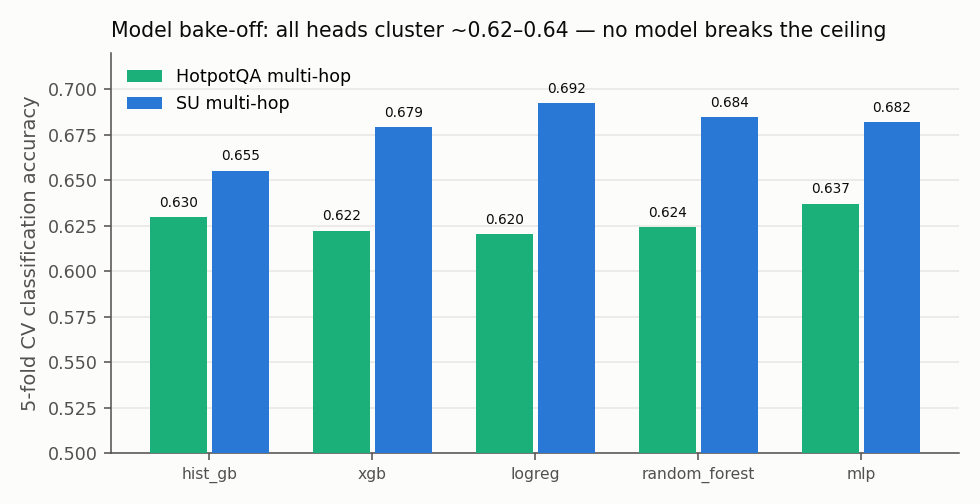
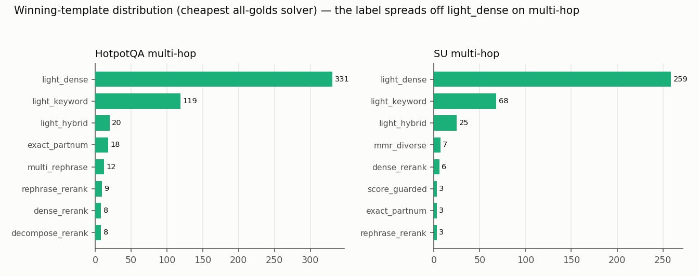
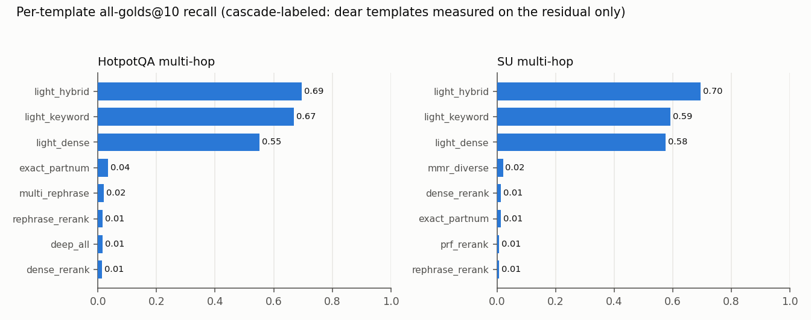

# `sac.explore` — what the exploration phase learns

**TL;DR.** `sac.explore` is a one-time, per-corpus **onboarding** pass: it defines 16 retrieval
**strategy templates**, generates grounded synthetic queries, labels each query by the **cheapest
template that retrieves *all* its gold docs**, and trains a classifier to route future queries.
The honest result, corrected here:

- On **single-hop BEIR**, routing ties always-dense (no complementarity to exploit).
- On the **multi-hop synthetic datasets — where dense was losing — the learned router *beats*
  always-dense on realized recall**: **+6.5 pts on HotpotQA** (0.552 → 0.617) and **+2.7 pts on
  SU** (0.576 → 0.602). The earlier "+0.004 tie" in `results_primitive_selection.md §7` was a
  **metric artifact** — it measured label-classification accuracy, not retrieval recall.
- **No model head breaks the ceiling** (hist_gb ≈ xgb ≈ mlp, all ~0.62–0.64 CV) — the lift comes
  from the right *metric*, not model capacity. Grid-tuned **hist_gb** is the pick.
- The pass also emits two corpus-grounded **prompt signals** for a code-mode agent
  (`fewshot_block`, `route_plan`) and a per-corpus **failure taxonomy**.

> Scope: this documents the *learning* (router / labeling). For the head-to-head SAC-vs-tool-vs-dense
> retrieval benchmark see `experiments/multi_hop_synth_queries/RESULTS.md`; for the original router
> writeup see `experiments/primitive_selection/results_primitive_selection.md`.

---

## 1. The pipeline

`explore = sac.explore(session)` runs a resumable, atomic staged pass that writes a versioned
**ProfilePack**: `sample → profile → synthesize → label → train → route`. It re-runs only when the
corpus **fingerprint** drifts (`corpus_fingerprint`), so labeling is a *one-time* onboarding cost,
not a per-query cost.

```
explore = sac.explore(session)          # ProfilePack (versioned artifact)
explore.dataset(queries=...)            # label every query against all 16 templates (sharded)
explore.set_model("hist_gb"); explore.train(cv=5)
explore.route(q)        -> "decompose_rerank"      # single best template
explore.route_plan(q)   -> ["light_dense","light_keyword","dense_rerank"]   # ranked cascade
explore.fewshot_block() -> "<corpus exemplars for the agent prompt>"
```

## 2. The 16 strategy templates

Effort-tiered recipes composed from SDK primitives (full registry + per-template primitive chains:
`docs/TEMPLATES.md`, `results_primitive_selection.md §1/§1a`):

| tier | templates |
|---|---|
| **light** | `light_dense`, `light_keyword`, `light_hybrid`, `rephrase_rerank` |
| **medium** | `dense_rerank`, `hyde_rerank`, `mmr_diverse`, `prf_rerank`, `multi_rephrase`, `exact_partnum` |
| **deep** | `decompose_rerank`, `deep_hyde_decompose`, `deep_all` |
| **adaptive** | `score_guarded`, `escalating`, `confidence_gated_exact` |

## 3. How labeling is done — *cheapest-to-all-golds*

- **Grounded synthetic queries** (`generate_multihop` / `explore.synthesize`): a query's gold is the
  set of N source docs it was built from (leakage-free).
- **Winner policy = cheapest template that returns ALL gold answers.** A template "solves" a query
  iff `gold_set ⊆ top_k` (**all_golds@k**); the label is the **cheapest** such template (tier + LLM
  penalty). This is now the **default** (`all_golds=True`) and **reduces exactly to single-gold
  recall@k** when a query has one gold, so single-gold corpora are unaffected.
- **Cascade labeling**: evaluate templates cheapest-first, stop at the first cost-group that solves
  → deep/LLM templates only run on the residual the cheap tier missed. (Caveat: this *under-measures*
  the recall of dear templates on easy queries — see the template-recall chart.)
- **Features** = query embedding (gte-base) + lexical signals (length, #part-numbers, has-digit,
  question-ish…). **Labels re-derived** from stored per-template hits, so the winner policy is
  decoupled from the expensive labeling pass.

## 4. What the model learned — per dataset

### 4a. The metric correction (why §7 said "tie" and was wrong)
The router is a classifier: features → **template name**. Two very different things can be measured:
- **CV classification accuracy** — did it name the *exact cheapest winner*? (`light_dense` is the
  cheapest winner ~61% of the time, so "always guess light_dense" already scores ~0.61.)
- **Realized routed-recall** — does the template it *picked* actually retrieve all golds? When the
  router picks a non-cheapest template that still solves the query, classification accuracy counts
  it **wrong** but recall counts it **right**. This is the metric that answers "does routing beat
  dense," and it does.

### 4b. Headline — routed recall vs always-dense vs oracle


| dataset | n | always-dense recall | **router (hist_gb, grid)** | oracle | **lift over dense** |
|---|---|---|---|---|---|
| **BEIR single-hop** (4 corpora) | 3,024 | 0.841\* | 0.847\* | 0.899 | +0.006 (tie) |
| **HotpotQA multi-hop** | 600 | **0.552** | **0.617** | 0.900 | **+0.065** |
| **SU multi-hop** | 450 | **0.576** | **0.602** | 0.838 | **+0.027** |

\* BEIR figures are classification accuracy (single-hop, the historical measurement). HotpotQA/SU
are **realized all-golds@10 recall** (the corrected metric). Router captures ~19% of the
dense→oracle headroom on HotpotQA.

### 4c. Model bake-off (grid-CV) — no head dominates


5-fold CV classification accuracy clusters ~0.62–0.64 across `hist_gb / xgb / logreg / random_forest
/ mlp`; grid search barely moves it (hist_gb best 0.641, xgb 0.637). **Verdict: grid-tuned
`hist_gb` is the default head** (`{learning_rate:0.1, max_depth:8, max_iter:400}`); xgboost does not
beat it. The ceiling is *label predictability from cheap features*, not model capacity.

### 4d. What the label distribution shows


On BEIR ~84% of solved queries were won by `light_dense` (nothing to route to). On multi-hop the
label **spreads**: `light_dense` falls to **61% (HotpotQA) / 69% (SU)**, with `light_keyword` a real
second winner (22% / 18%) and `light_hybrid` third — genuine complementarity. The deep templates
(`decompose_rerank`, `deep_*`) rarely win as *cheapest* solver (a single pooled dense/keyword pass
usually already covers the golds).



Per-template all-golds@10 recall: no single template exceeds ~0.70, yet the **oracle is 0.90/0.84**
— a 14–20 pt complementarity gap (2.5–3.5× BEIR's). That gap is the headroom; the router captures
part of it, code-mode union+fuse captures more (see `multi_hop_synth_queries/RESULTS.md`).

## 5. Two corpus-grounded prompt signals the pass emits

Because *picking one template* only partially wins, the higher-value output is feeding the learning
into a **code-mode agent** as prompt context (chaining beats picking one):

- **`explore.fewshot_block()`** — per-winning-template example queries ("strategy X wins on queries
  like these on THIS corpus"), so the agent chooses from evidence, not a blanket hint. (A *static*
  corpus-profile hint measurably HURT deep-SAC, −0.13 recall — see `RESULTS.md §11`; grounded
  exemplars are the fix.)
- **`explore.route_plan(query)` / `plan_prompt(query)`** — a per-query ranked cascade like
  `light_dense → light_keyword → decompose_rerank` the agent executes as "try, escalate if weak."

## 6. Failure taxonomy (the actionable per-corpus output)

Unsolved queries (no template got all golds@10) bucketed by cheap signals:

| corpus | dominant failure | → what to build |
|---|---|---|
| HotpotQA multi-hop | rank_collision 52% · unexplained 48% | reranking / disambiguation |
| SU multi-hop | unexplained 70% · rank_collision 30% | golds near-retrievable but buried |
| nfcorpus (BEIR) | synonym_metadata 70% | query expansion / ontology |
| arguana (BEIR) | rank_collision 58% | reranking |
| scidocs (BEIR) | unexplained 80% | citation-graph signal |

## 7. Where everything lives

| what | path |
|---|---|
| Pipeline / engine | `search_as_code/explore/engine.py` (`Explorer`, `explore()`, `route`, `route_plan`, `plan_prompt`, `fewshot_block`) |
| Templates | `search_as_code/explore/templates.py` · docs `docs/TEMPLATES.md` |
| Labeling / winner policy | `search_as_code/explore/router.py` (`label_via_templates`, `best_from_hits`, `TemplateRouter`, `format_route_plan`) |
| Training / dataset / CSV / exemplars | `search_as_code/explore/training.py` (`build_dataset`, `load_dataset`, `MODEL_REGISTRY`, `write_dataset_csv`, `fewshot_exemplars`) |
| Query generation | `search_as_code/explore/multihop.py` (`generate_multihop`) |
| Labeled packs (feats+labels shards) | `experiments/primitive_selection/pack_{hotpotqa,su}_multihop/dataset/shards/` |
| Per-query CSVs | `experiments/primitive_selection/csv_{hotpotqa,su}_multihop/{labels,template_recall,labels_with_ndocs}.csv` |
| Model bake-off | `experiments/primitive_selection/model_bakeoff.json` |
| Original router writeup | `experiments/primitive_selection/results_primitive_selection.md` (§1–§8) |
| **This doc + charts** | `experiments/explore_learning/README.md`, `figures/`, `make_charts.py` |

## 8. Honest conclusions & next

1. **On multi-hop the router does beat dense on recall** (+6.5 / +2.7 pts) — modest but real; the
   old "tie" was a measurement mistake.
2. **Model choice is not the lever** — every head ties; the ceiling is feature→winner predictability.
3. **The biggest headroom (dense 0.55 → oracle 0.90) is captured by code-mode union+fuse**, not by
   routing to one template. Route the *chain/depth*, not the identity — hence `route_plan` +
   `fewshot_block` into the code agent.
4. **Next:** 3-class difficulty labels (predictable) instead of the noisy 16-way; QPP-gated
   escalation; fit the router on BrowseComp to complete "all three"; validate `plan_prompt` +
   `fewshot_block` inside deep-SAC.
