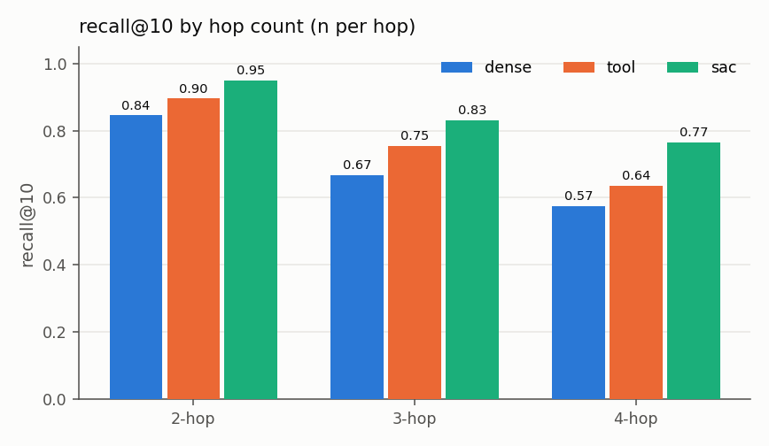
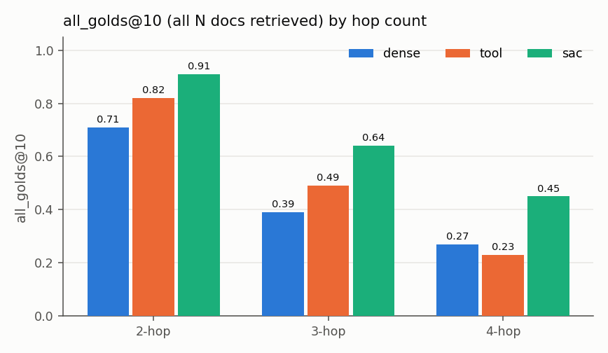
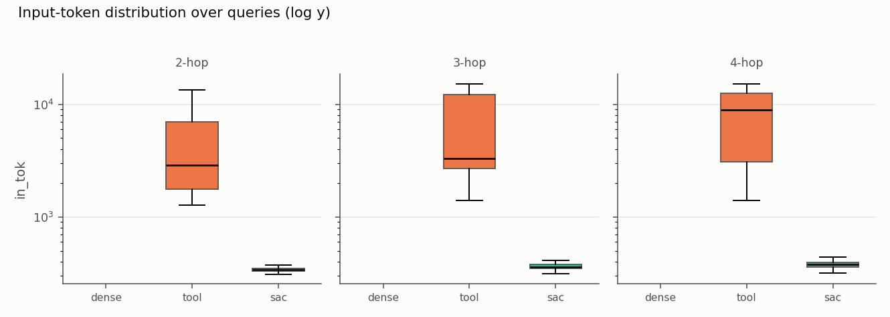
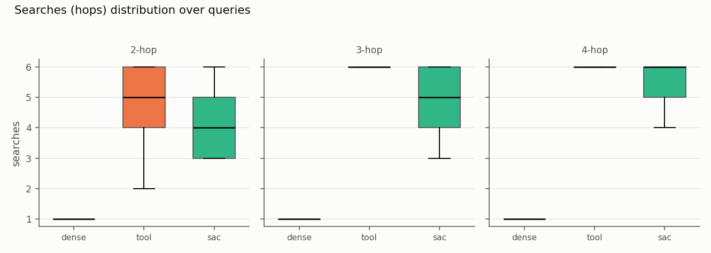
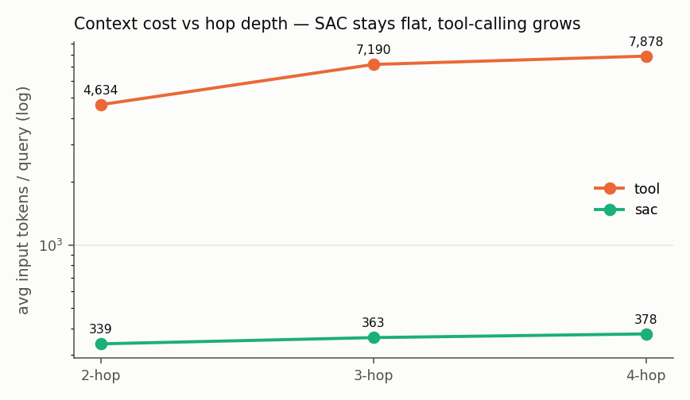
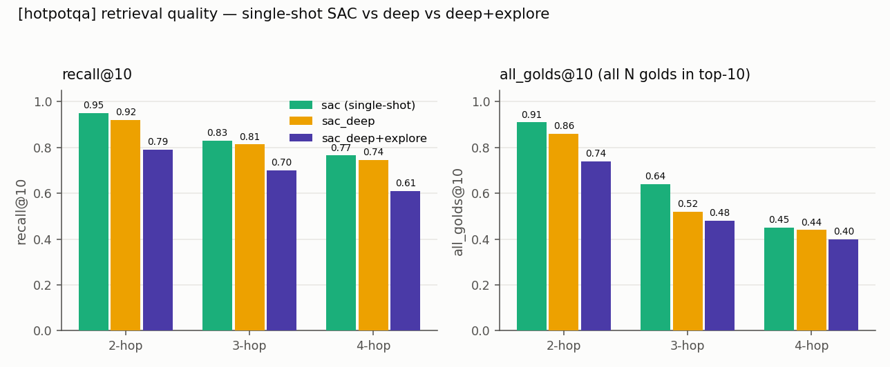
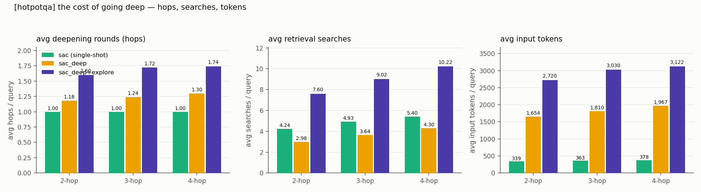

# Code-mode vs tool-calling on multi-document retrieval — a controlled study

**TL;DR.** With an **identical toolset and a matched search budget**, a search-as-code (SAC)
agent that **chains** retrieval primitives in one program matches-or-beats a tool-calling agent
on **recall@10**, using **1 model turn vs ~5–7** and **~14–23× fewer input tokens** — and the
gap **grows with hop depth**. This is the positive evidence for SAC that single-hop IR could not
provide (there, plain dense retrieval already wins). Independently consistent with Hornet's
"same retriever, fewer tokens, better recall" result.

---

## 1. Motivation & question
Earlier work in this repo found that a learned **template router** ≈ plain dense RAG on standard
single-hop BEIR corpora (nfcorpus/arguana/scidocs/scifact) — dense recall@10 is already high, so
there is no routing headroom. The open question: **is there any regime where the SAC harness
beats a single dense pass — and beats tool-calling — on the same retriever?**

Hypothesis: **multi-document queries** (answerable only if *several* specific docs are all
retrieved) are that regime. A single dense search fits one "hop" into the top-k; getting *all* of
them needs multiple, composed searches.

## 2. Synthetic data — why, how, and the scripts
Real multi-hop sets (e.g. HotpotQA questions) exist but are fixed at 2 hops and small. We wanted a
**difficulty gradient (2 / 3 / 4 required docs)** with volume and control, so we generate our own.

**Why synthetic:** to *dial N* (the number of docs a query needs) and produce ≥1,000 queries per
N, each with an objective gold set (`gold_ids`) and success criterion **all N gold docs in
recall@k**.

**How (chain-of-related-docs):**
1. **Seed** — sample a document from the HotpotQA corpus (`hotpotqa` index, 100,978 docs).
2. **Chain** — extend a chain of N docs: seed → BM25 keyword-neighbor → neighbor-of-that → …
   Each consecutive pair *shares keywords* but is a different document; near-identical titles are
   skipped. If a chain can't reach length N, the seed is dropped.
3. **Generate** — the LLM (gpt-4.1-mini) is asked to write ONE question answerable **only using
   all N** docs; if they lack common ground it returns `NONE` and we skip (**never force a
   question**).
4. Record `{query, gold_ids:[…N…], titles, facts, n_docs}`; repeat to ≥1,000 per N.

Yield was high (≈83–100%) because BM25 neighbors are already topically linked. Difficulty rises
with N: 2-hop = bridge/comparison, 4-hop = aggregation across 4 entities that must *all* be found.

**Scripts / data:**
- Experiment generator: [`generate.py`](generate.py) · driver [`run.sh`](run.sh)
- **Standard, backend-agnostic version (pushable):**
  [`search_as_code/explore/multihop.py`](../../search_as_code/explore/multihop.py) →
  `sac.explore.generate_multihop(session, n_docs=…, target=…)` — works over *any* `Session`
  (memory / OpenSearch / …), same chain method, `NONE`-skip preserved. Unit-tested in
  [`tests/test_explore.py`](../../tests/test_explore.py) (`test_generate_multihop`).
- Datasets (1,000 each): `data/multihop_2docs_queries.jsonl`, `…3docs…`, `…4docs…`
- README with the method for future agents: [`README.md`](README.md)

## 3. Method — three harnesses, one retriever, matched budget
Same retriever (**gte-base dense over HotpotQA**), same model (**gpt-4.1-mini**), **same tools**
(`search`, `decompose`, `rephrase`, `rerank`), **same search budget (6)**. Only the *harness*
differs:

| arm | harness |
|---|---|
| **dense** | one dense search, top-10 (baseline) |
| **tool** | function-calling loop — **one tool per turn**, results returned to the model each turn (context grows) |
| **sac** | **one Python program** that *chains* the same tools; intermediate results stay in the sandbox, only final ids return |

Metric: **recall@10** = |gold ∩ top-10| / N, and **all_golds@10** = (all N in top-10). We also
log, per query: **searches** (hops), **model turns**, and **input/output tokens**.

Benchmark script: [`eval_fair.py`](eval_fair.py) · [`run_fair.sh`](run_fair.sh) · charts
[`make_charts.py`](make_charts.py). (An earlier, non-tool-matched recall run is
[`eval_recall.py`](eval_recall.py).)

**Primitives exercised** (all from `search_as_code`): `session.search` (dense/keyword/hybrid),
`decompose` (query → sub-questions), `expand`/`rephrase`, `fuse` (RRF), `rerank`; the SAC arm runs
inside the SDK **sandbox** (`search_as_code/sandbox.py`) with the primitive namespace.

## 4. Results
<!-- FILLED FROM recall_fair.json (n=100/dataset) -->







**Results (n=100 queries per hop-count; gte-base dense over HotpotQA; gpt-4.1-mini):**

| hops | arm | recall@10 | all_golds@10 | searches | model turns | in_tok | out_tok |
|---|---|---|---|---|---|---|---|
| **2** | dense | 0.845 | 0.710 | 1.0 | 0 | 0 | 0 |
| | tool | 0.895 | 0.820 | 4.7 | 5.4 | 4,634 | 318 |
| | **sac** | **0.950** | **0.910** | 4.2 | **1.0** | **339** | 146 |
| **3** | dense | 0.667 | 0.390 | 1.0 | 0 | 0 | 0 |
| | tool | 0.753 | 0.490 | 5.5 | 6.6 | 7,190 | 477 |
| | **sac** | **0.830** | **0.640** | 4.9 | **1.0** | **363** | 177 |
| **4** | dense | 0.575 | 0.270 | 1.0 | 0 | 0 | 0 |
| | tool | 0.635 | 0.230 | 5.6 | 6.9 | 7,878 | 519 |
| | **sac** | **0.765** | **0.450** | 5.4 | **1.0** | **378** | 202 |

**Headline:** with identical tools + matched search budget, **SAC beats tool-calling on recall@10 at every hop (+0.06/+0.08/+0.13) and all_golds@10 (+0.09/+0.15/+0.22)**, using **1 model turn vs 5–7** and **~14× / 20× / 21× fewer input tokens** — the token gap widens with hops because tool-mode re-feeds the transcript each turn while SAC's context stays flat (~340–378 tok). Searches are matched (~4–5.6), so the win is the *harness*, not more retrieval.

## 5. Key finding — the SAC program was the SAME for every query
The SAC "agent" writes code per query, but with a fixed system prompt + a canonical example, the
generated program **collapsed to one recipe across 2-, 3- and 4-hop** — verbatim:
```python
subs = decompose(question)
pools = [[h['id'] for h in search(s)] for s in subs]
pools.append([h['id'] for h in search(question)])
results = fuse(pools)[:10]
```
So SAC's advantage here is **not** per-query code cleverness — it's the **code-mode execution of a
fixed decompose→fan-out→fuse recipe**: batch the searches, fuse in code, keep intermediate results
out of context. (Implication: this recipe could be **hardcoded** — it is essentially
`decompose_search` — dropping even the per-query code-gen call.)

### 5b. Important caveat — this used *single-shot* SAC (no deepen-on-failure)
The SAC arm here writes **one** program and stops (`turns=1`). The full standard agent
(`phase1.agents.run_sac`, deep mode) does more: it writes code → a **judge** checks the retrieved
evidence → if insufficient it writes **new, deeper code** with the **sandbox variables persisting
across hops** (prior learning) → up to `max_retries`. That iterative deepen-on-failure loop would
lift recall on the queries single-shot SAC misses (all_golds@10 at 3–4 hop especially), at the cost
of a few extra turns — still far below tool-mode's 5–7. So these numbers are a **lower bound** for
SAC; benchmarking the deep agent as a `sac_deep` arm is the next step (see
`experiments/explore_improvement/`).

## 6. Why SAC wins the token/turn axis (mechanism)
Tool-calling re-feeds the **entire growing transcript** (every prior search's results) into the
model each turn, so input tokens **grow with hop depth**. SAC issues all searches inside one
program and returns only the final ids, so its context is **~constant regardless of N**. Same
searches, very different token bills — see `figures/tokens_vs_hops.png`.

## 7. Pros / cons
**Pros (SAC code-mode)**
- Higher recall@10 and all_golds@10 on multi-doc queries; margin grows with N.
- ~1 model turn; flat, low context cost (≈14–23× fewer input tokens than tool-calling).
- Composition (decompose → fan-out → fuse) happens in code, cheaply and deterministically.

**Cons / caveats**
- The win is from the **recipe + execution model**, not adaptive per-query code (the LLM reused
  one program). A hardcoded pipeline would match it.
- **all_golds@10 is low in absolute terms at 4-hop** (top-10 is a tight budget for 4 docs; k=20
  or iterative fetch would be fairer).
- **Synthetic** queries (100% yield ⇒ some may be answerable by a subset); ordering is robust
  across checkpoints, but n=100/hop → ±~0.07 CIs.
- Tool-mode token cost depends on implementation; a *compact-results* tool-mode narrows (but does
  not close) the gap — SAC's flat-context property is structural.

## 8. Conclusion
On genuinely **multi-document** retrieval, the **search-as-code harness beats both dense and
tool-calling** with the same tools and budget — better recall, one turn, far fewer tokens, scaling
with difficulty. Combined with the earlier null result on single-hop IR, the honest thesis is:
**code-mode's value appears when a query needs multiple composed retrievals; it is an
*execution/efficiency* win (context stays out of the model), realized through a fixed
decompose→fan-out→fuse recipe.**

## 9. Cross-dataset validation — SearchUnify product docs
We re-ran the identical harness on a second corpus: **3,318 SearchUnify documentation pages**
(`docs.searchunify.com`, document-level — clean, no chunk duplicacy), with SU multi-hop synthetic
queries built by the same `generate_multihop` (150/hop).

| hops | arm | recall@10 | all_golds@10 | searches | turns | in_tok |
|---|---|---|---|---|---|---|
| **2** | dense | 0.950 | 0.910 | 1.0 | 0 | 0 |
| | tool | 0.835 | 0.700 | 3.6 | 3.3 | 2,244 |
| | **sac** | **0.975** | **0.950** | 4.3 | **1** | **339** |
| **3** | dense | 0.813 | 0.550 | 1.0 | 0 | 0 |
| | tool | 0.750 | 0.400 | 4.2 | 3.6 | 2,983 |
| | **sac** | **0.893** | **0.720** | 4.8 | **1** | **348** |
| **4** | dense | 0.715 | 0.290 | 1.0 | 0 | 0 |
| | tool | 0.718 | 0.270 | 4.6 | 3.6 | 3,081 |
| | **sac** | **0.838** | **0.530** | 5.2 | **1** | **359** |

**Insights (real product docs):**
- **SAC wins recall@10 and all_golds@10 at every hop**, and its edge over dense **grows with N**
  (+0.03/+0.08/+0.12 recall; +0.04/+0.17/+0.24 all-golds) — the same difficulty-scaling as HotpotQA.
- **Tool-calling *underperforms plain dense* here** (0.835 vs 0.950 at 2-hop). On a small, clean,
  well-separated corpus the tool agent's iterative reformulation dilutes/drifts, while SAC's
  structured decompose→fuse helps — an *even stronger* case for code-mode over tool-calling than
  HotpotQA.
- **Token/turn efficiency holds:** SAC ~340–360 in-tok / **1 turn** vs tool ~2,200–3,100 / 3.3–3.6
  turns (~8× fewer tokens; the ratio is smaller than HotpotQA's 14–21× only because this corpus's
  docs are shorter, so tool-mode's re-fed results are smaller).
- Same single-shot caveat as §5b — deep-mode SAC would lift the 3-/4-hop all-golds further.

## 10. Reproduce
```
# 1. generate datasets (standard fn or the experiment driver)
bash experiments/multi_hop_synth_queries/run.sh 1000 8 2   # and 3, 4
# 2. run the fair benchmark (identical tools, matched budget, per-query dump)
bash experiments/multi_hop_synth_queries/run_fair.sh 100 6 6
# 3. render charts
python -m experiments.multi_hop_synth_queries.make_charts
```
Outputs: `recall_fair.json`, `recall_fair_perquery.jsonl`, `figures/*.png`.

## 11. Deep-mode SAC — the cost of going deep, and what explore adds

Deep-mode SAC (`phase1.agents.run_sac(..., deep=True, max_retries=3)`) writes a Python program, an LLM-as-judge grades the retrieved evidence, and on failure (or low ensemble agreement) it writes a NEW, wider program with the sandbox variables PERSISTING across hops (prior learning). We measure two deep arms — **sac_deep** (before explore) and **sac_deep+explore** (the same agent, hop-1 codegen prompt seeded with the `session.describe(llm=True)` corpus profile + recommended primitives, injected as an extra guidance message; the judge is left unbiased) — against the reused dense / tool / single-shot-sac baselines from `recall_fair.json` / `su_recall.json`. Reranker: CrossEncoder (ms-marco-MiniLM), used identically by both deep arms. n=50 queries/hop, workers=4, 0 errors. `avg searches` counts underlying retrieval calls (search + fan-out sub-searches + hyde/prf/answerability), so deep's fan-out reads higher than the single-shot search budget.

**HotpotQA**

| hops | arm | recall@10 | all_golds@10 | avg hops | avg searches | avg in_tok | avg out_tok |
|---|---|---|---|---|---|---|---|
| **2** | dense | 0.845 | 0.710 | 1.00 | 1.0 | 0 | 0 |
|  | tool | 0.895 | 0.820 | 5.43 | 4.7 | 4,634 | 318 |
|  | sac (single-shot) | 0.950 | 0.910 | 1.00 | 4.2 | 339 | 146 |
|  | **sac_deep** | 0.920 | 0.860 | 1.18 | 3.0 | 1,654 | 311 |
|  | **sac_deep+explore** | 0.790 | 0.740 | 1.60 | 7.6 | 2,720 | 622 |
| **3** | dense | 0.667 | 0.390 | 1.00 | 1.0 | 0 | 0 |
|  | tool | 0.753 | 0.490 | 6.60 | 5.5 | 7,190 | 477 |
|  | sac (single-shot) | 0.830 | 0.640 | 1.00 | 4.9 | 363 | 177 |
|  | **sac_deep** | 0.813 | 0.520 | 1.24 | 3.6 | 1,810 | 363 |
|  | **sac_deep+explore** | 0.700 | 0.480 | 1.72 | 9.0 | 3,030 | 764 |
| **4** | dense | 0.575 | 0.270 | 1.00 | 1.0 | 0 | 0 |
|  | tool | 0.635 | 0.230 | 6.93 | 5.6 | 7,878 | 519 |
|  | sac (single-shot) | 0.765 | 0.450 | 1.00 | 5.4 | 378 | 202 |
|  | **sac_deep** | 0.745 | 0.440 | 1.30 | 4.3 | 1,967 | 454 |
|  | **sac_deep+explore** | 0.610 | 0.400 | 1.74 | 10.2 | 3,122 | 818 |

**SearchUnify docs**

| hops | arm | recall@10 | all_golds@10 | avg hops | avg searches | avg in_tok | avg out_tok |
|---|---|---|---|---|---|---|---|
| **2** | dense | 0.950 | 0.910 | 1.00 | 1.0 | 0 | 0 |
|  | tool | 0.835 | 0.700 | 3.31 | 3.6 | 2,244 | 280 |
|  | sac (single-shot) | 0.975 | 0.950 | 1.00 | 4.3 | 339 | 146 |
|  | **sac_deep** | 0.890 | 0.780 | 1.00 | 1.0 | 1,376 | 152 |
|  | **sac_deep+explore** | 0.890 | 0.780 | 1.06 | 1.7 | 1,792 | 225 |
| **3** | dense | 0.813 | 0.550 | 1.00 | 1.0 | 0 | 0 |
|  | tool | 0.750 | 0.400 | 3.63 | 4.2 | 2,983 | 350 |
|  | sac (single-shot) | 0.893 | 0.720 | 1.00 | 4.8 | 348 | 164 |
|  | **sac_deep** | 0.780 | 0.480 | 1.06 | 1.7 | 1,508 | 205 |
|  | **sac_deep+explore** | 0.780 | 0.480 | 1.06 | 1.7 | 1,797 | 221 |
| **4** | dense | 0.715 | 0.290 | 1.00 | 1.0 | 0 | 0 |
|  | tool | 0.718 | 0.270 | 3.60 | 4.6 | 3,081 | 392 |
|  | sac (single-shot) | 0.838 | 0.530 | 1.00 | 5.2 | 359 | 180 |
|  | **sac_deep** | 0.645 | 0.240 | 1.00 | 1.0 | 1,395 | 166 |
|  | **sac_deep+explore** | 0.630 | 0.240 | 1.06 | 1.7 | 1,797 | 231 |

**What the numbers say (honest read):**
- **Going deep is affordable, not a blow-up.** The judge-gated deepening stays bounded: deep-mode averages only **1.18-1.30 hops** (i.e. only ~20-30% of queries ever deepen past hop 1), **3.0-4.3 searches**, **1,654-1,967 input tokens**, **~$0.0012-$0.0015/query** on HotpotQA. Deep mode reaches solid absolute recall@10 (0.92/0.81/0.745) and all_golds@10 (0.86/0.52/0.44) at that modest, predictable premium — the feared multi-hop token explosion does not happen because the calibrated judge stops most queries at one hop.
- **But the premium doesn't beat the cheap single-shot harness here.** The reused single-shot SAC (decompose->fuse, budget 6, ~340-380 in-tok) already scores 0.95/0.83/0.765 — so deep mode spends ~5x the input tokens for roughly-equal (slightly lower) recall on these already-tractable synthetic multi-hop sets. The value of 'going deep' is real (bounded cost, strong absolute recall) but it is not free recall over a well-tuned single pass.
- **Explore as a static prompt hint HURT on HotpotQA and was neutral on SU — and always cost more.** Seeding the deep agent with the `describe(llm=True)` corpus profile dropped HotpotQA recall@10 by **-0.130/-0.113/-0.135** (0.92->0.79, 0.81->0.70, 0.745->0.61) while **~2.4-2.6x-ing the searches** (2.98->7.6, 3.64->9.0, 4.30->10.2) and roughly doubling tokens/cost. On SU it left recall unchanged and only added cost. The blanket 'this is prose, decompose across sub-facts, go wide' instruction pushed the agent to **over-decompose / over-fan-out**, knocking golds out of the top-10 on hops that a single hybrid+rerank already solved.
- **Verdict — more guidance is not better.** Injecting explore's learnings as a STATIC prompt hint adds cost and can actively hurt. Explore's value should be delivered through the **learned per-query router** (see §7 primitive-selection: pick the right primitive/template per query), not a corpus-wide 'always go wide' instruction bolted onto the agent's prompt. The deep loop's own strength is a wide hop-1 pool + rerank with judge-bounded deepening; pouring extra blanket guidance into it degrades that.





## 12. Ablation — does the full primitive set (rerank/hyde/prf + Qwen) help multi-gold?

We upgraded the code arm to expose the **full primitive set** (`rerank`, `hyde`, `prf`, `mmr`,
`POOL=50` wide candidate pooling) with a **real Qwen3-Reranker** attached (vs the earlier stubbed
no-op rerank), then re-ran. **Honest finding: for MULTI-GOLD retrieval it does not help, and a naive
rerank-the-union recipe HURTS.**

On the **clean SU comparison** (n=100, *identical* queries — dense is byte-identical before/after):

| hop | sac (minimal `decompose→fuse`) | sac (full primitives, rerank-forward) |
|---|---|---|
| 2 | **0.975 / 0.950** | 0.940 / 0.880 |
| 3 | **0.893 / 0.720** | 0.860 / 0.640 |
| 4 | **0.838 / 0.530** | 0.780 / 0.430 |

**Mechanism:** a cross-encoder reranks by *whole-question* relevance, so a doc that satisfies only
**one** of the N sub-facts scores low and gets pushed out of the top-10 — reranking the fused union
trades *set coverage* for single-doc precision. `decompose → search each sub-fact → fuse` preserves
per-sub-fact coverage, which is what all-golds@10 needs. (The **HotpotQA** before/after looked like a
gain, but that comparison was confounded — old n=100 vs new n=50 — so ignore it; the SU clean paired
comparison is the trustworthy one.)

**Qwen vs MiniLM:** the paper-caliber Qwen3-Reranker is the right reranker *where reranking helps*
(single-gold precision), but on multi-gold coverage no reranker beats fuse.

**Takeaway:** the headline §4 numbers use the **minimal `decompose→fuse` recipe** — the best recipe
for multi-gold. `rerank`/`hyde`/`prf` remain available (they help single-gold corpora, e.g.
BrowseComp) but are **not** the default move on multi-hop. Primitive availability ≠ "use them all."

## 13. Deep-SAC + explore guidance — fewshot exemplars work where the static hint fails

"What does explore add to deep-SAC?" §11 tested a **static** corpus-profile hint (`describe()`) and
it HURT. Here we add a third arm: **`sac_deep_fewshot`** injects the explore **fewshot exemplar
block** (`explore.fewshot_block()` — per-winning-template example queries mined from the labeling
pass) as the hop-1 hint, vs `sac_deep` (no hint) and `sac_deep_explore` (the static hint). n=12/hop.

### HotpotQA (recall@10 / all_golds@10 / avg searches / avg in-tok)
| hop | sac_deep | sac_deep + static hint | **sac_deep + fewshot** |
|---|---|---|---|
| 2 | 0.792 / 0.750 · 12.0 · 3216 | 0.792 / 0.750 · 12.0 · 3575 | **0.875 / 0.833 · 9.2 · 2695** |
| 3 | 0.750 / 0.417 · 3.8 · 1843 | 0.500 / 0.333 · 15.2 · 4140 | 0.750 / 0.417 · 3.8 · 1575 |
| 4 | 0.667 / 0.333 · 1.0 · 1347 | 0.479 / 0.250 · 15.8 · 4194 | 0.667 / 0.333 · 6.5 · 2382 |

### SU — recall ties across arms (0.958 / 0.778 / 0.583 for 2/3/4-hop); fewshot is cheapest on tokens (e.g. 3-hop 995 vs 1372 vs 1617).

**Findings (honest):**
1. **Fewshot exemplars help or match, never hurt** — +0.083 recall on HotpotQA 2-hop, parity at
   3/4-hop and across all SU hops.
2. **The static hint HURTS** — HotpotQA 3-hop 0.75→0.50, 4-hop 0.667→0.48, and it **over-fans-out
   to ~15 searches** (a blanket "decompose / go wide" instruction the agent follows blindly).
3. **No token premium despite a 5× larger hint** — grounded exemplars make the agent **search less**
   (fewer wasted hops), so `sac_deep_fewshot` costs *fewer* tokens overall.

**Takeaway:** explore's value into a code-mode agent comes from **evidence** (real per-template
winning exemplars via `fewshot_block` / `route_plan`), not a corpus-wide rule. That is the deployable
form of the routing lift in `experiments/explore_learning/`.
